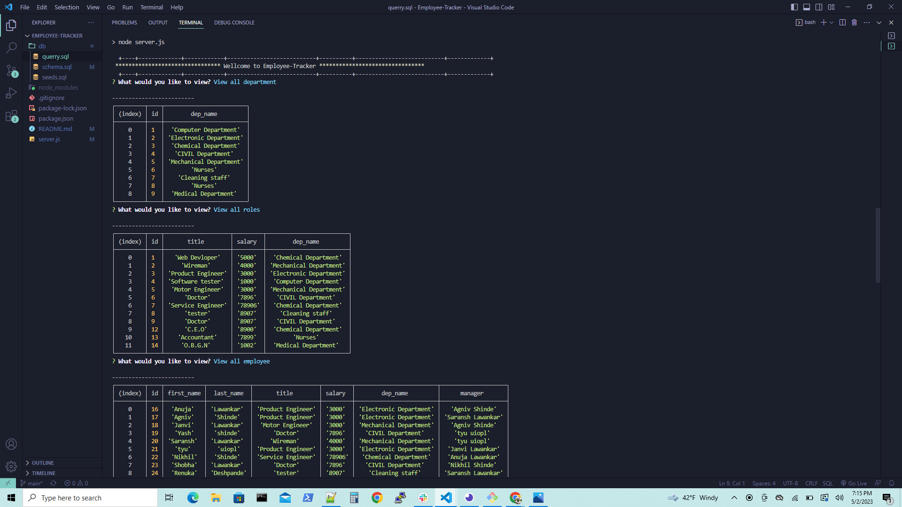

# Employee-Tracker

## Description:-

1. Employee-Tracker is used to manage and keep track on employee information for particular busniess database. which is called content management systems (CMS).

2. This is a command line application. Where questions answers prompts are used to display data from database.

3. When user started the application, Then the following options will pop up:- view all departments, view all roles, view all employees, add a department, add a role, add an employee, and update an employee role.

4. When user select to view all departments, Then all data from department table will be displayed in formed of table.

5. When user select to view all roles, Then all data from department table will be displayed in formed of table.

6. When user select to view all employee, Then all data from department table will be displayed in formed of table.

7. When user select to add a department, Then data is added in the department table and displayed in formed of table.

8. When user select to add a roles, Then data is added in the role table and displayed in formed of table.

9. When user select to add an employee, Then data is added in the an employee table and displayed in formed of table.

10. When user select update an employee, Then new role and other information will updated in the database.

11. Database is created in schema.sql file and values which are inserted in tables are in seeds.sql, There is also querry.sql where all mysql querries are written.

## Steps I followed:-

1. First  created the "New Repository" i.e "Employee-Tracker" in GitHub.

2. In GitBash  navigate to the repository and  to clone "SVG-Logo-Maker" repository. Using "cd" command.

3. Then used "git clone <ssh key>" of "Employee-Tracker" and clone the repository.

4. Then  created server.js, gitignore, package.json, database file i.e schema.sl, seeds.sql, querry.sql and README files using touch command.

5. Run "code ." command to open VS.

6. Executed the code by installing npm install command.

7. Write the code and run by using npm start command.

8.  Created  database cms_db in schema and also created tables like department, role, employee and seed that tables with INSERT command. SOURCE command is used to run  schema.sql and seeds.sql 

9. After that, added code to GitHub by using "git add -A" command on Gitbash. 

10. Commit the code and add commit message by using "git commit -m <message>".

11. Pull code by using "git pull origin main".

12. Push the code by using "git push origin main".

13. All the final code push in my "Employee-Tracker" repository.

 

## URLs:-
Here, you can find the walkthrough video for "Employee-Tracker":- 

https://drive.google.com/file/d/1a_d--3g0zastzSb1Wbx0SJo0jrUKGMS5/view

Here, you can find the GitHub URL:-

https://github.com/AnujaLawankar/Employee-Tracker

## Installation

1. Install inquirer, please use npm i inquirer@8.2.4.
2. Import mysql package.
3. Import express package

## Usage

Used to manage and keep track on employee information stored in databases. which is called content management systems (CMS).

## License

 MIT  License  

## Assets:-

The following image demonstrates the application's appearance:

